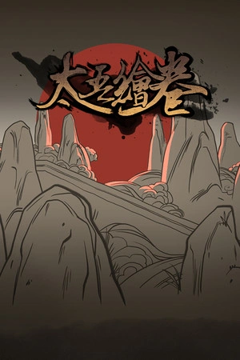

  

  

---

📫 Como me contatar: [emanuelsilva.slz@gmail.com](mailto:emanuelsilva.slz@gmail.com)  

---

**Tecnologias & Ferramentas:**

**Aprendendo:**

---

**Estatísticas do GitHub:**

---

**Estatísticas de Contribuição:**

---

**Troféus** 

  

---

**Projetos em Destaque:**

  <table>
    <tr>
      <td align="center" width="50%">
        
      </td>
      <td align="center" width="50%">
        
      </td>
    </tr>
    <tr>
      <td align="center">
        
      </td>
      <td align="center">
        
      </td>
    </tr>
    <tr>
      <td align="center">
        
      </td>
      <td align="center">
        
      </td>
    </tr>
  </table>

---

**Gráfico de Contribuições & Atividade de Commits:**

---

**Conecte-se comigo:**

---

**No meu tempo livre:**

  <table>
    <tr>
      <td align="center" width="50%">
          
          
          
        
      </td>
      <td align="center" width="50%">
        
      </td>
    </tr>
  </table>

---

**Jogo da Cobrinha**

  

  ✨ Obrigado por visitar! Sinta-se à vontade para explorar meus repositórios. 🚀

  

